## Cells are Important
\begin{columns}
	\begin{column}{0.5\textwidth}
	\Large
  \begin{itemize}
    \item Fundamental unit of life
    \item Autonomous and unique
    \item Interactive
    \item Dynamic - change over time
    \item Evolution occurs on the cellular level
  \end{itemize}
	\end{column}
	
	\begin{column}{0.5\textwidth}
	\center
	\includegraphics[width=2.25in]{figs/hooke.png}
	\end{column}
\end{columns}

## Cells are Diverse

\large
| Type    | Prokaryotes   | Eukaryotes    |
|:---------|:---------------|:---------------|
| Typical size | ~ 1-5 $\mu$m | ~ 10-100 $\mu$m |
| DNA form | Circular | Linear |
| DNA location | Cytoplasm | Nucleus | 
| DNA amount | ~ .3-16 fg | ~3-300,000 fg | 
| RNA amount | ~ 5-26,000 fg | ~ 1,000-350,000 fg |

\tiny
Landenmark HKE, Forgan DH, Cockell CS (2015). An Estimate of the Total DNA in the Biosphere. PLoS Biol 13(6): e1002168. https://doi.org/10.1371/journal.pbio.1002168


## Cells are Diverse: Microbial Ecology
\begin{columns}
	\begin{column}{0.55\textwidth}
	\Large
  \begin{itemize}
    \item Environments on Earth support microbial life
    \item Microbes usually work together in a balance
    \item Imbalances can disrupt the function of overall ecology
    \item Which specific microbes out of millions cause a particular effect?
  \end{itemize}
	\end{column}
	
	\begin{column}{0.45\textwidth}
	\center
	\includegraphics[width=2in]{figs/ecology.png}
	\end{column}
\end{columns}


\tiny
Mark Welch, et al. 2016. “Biogeography of a Human Oral Microbiome at the Micron Scale.” Proceedings of the National Academy of Sciences of the United States of America 113 (6): E791–800.

## Cells are Diverse: Human Brain
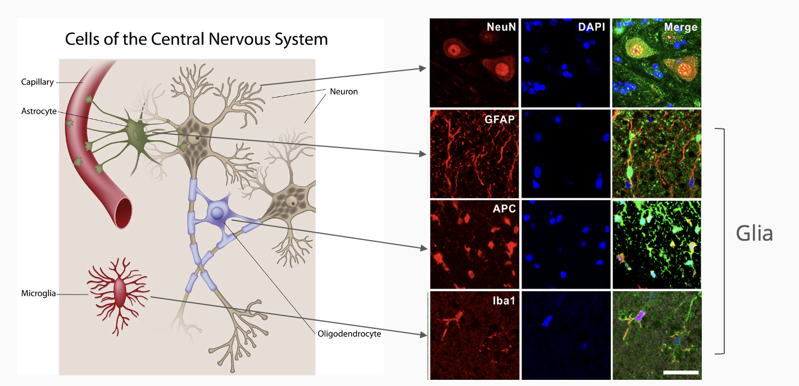

The vast majority of cells (10x-50x) in your brain are glia, not neurons 

## Cells are Diverse: Tumors
\begin{columns}
	\begin{column}{0.5\textwidth}
	\Large
  \begin{itemize}
    \item Tumors are seeded by single mutated cells
    \item Founder cells divide and further mutate
    \item Large tumors undergo angiogenesis
    \item Selectively kill cancer cells: cure the cancer
    \item But which cells to target?
  \end{itemize}
	\end{column}
	
	\begin{column}{0.5\textwidth}
	\center
	\includegraphics[width=2.5in]{figs/tumor.png}
	\end{column}
\end{columns}

\tiny
Kadota, Kyuichi, et al. 2014. “Comprehensive Pathological Analyses in Lung Squamous Cell Carcinoma: Single Cell Invasion, Nuclear Diameter, and Tumor Budding Are Independent Prognostic Factors for Worse Outcomes.” Journal of Thoracic Oncology: Official Publication of the International Association for the Study of Lung Cancer 9 (8): 1126–39.

## Tissues are Diverse: Molecular Profiling

\center


## The Forest: Tissue Homogenate
\center
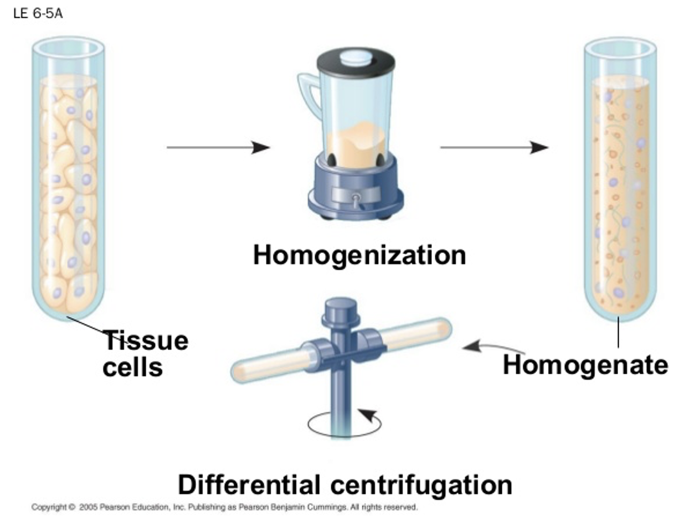{height=85%}


## The Trees: Cells

\Large
- What cell types are in a sample?
- What are their proportions?
- How does their transcription differ?
- Which/how do specific cells respond to stimulus?
- How do cells develop over time?
- What is the level of mosaicism in tissues

## Single Cell Sequencing Workflow

\Large
1. Dissociation of tissue, isolation of cells
2. FACS sorting (optional)
3. Nucleic acid extraction and processing
4. Sequencing library prep + sequencing
5. Analysis

## Dissociation of Tissue

\begin{columns}
	\begin{column}{0.6\textwidth}
	\large
  \begin{itemize}
    \item Cells in complex tissue are highly intermingled
    \item Separate cells without destroying or breaking membranes
    \item Complex cellular morphology (e.g. neurons) makes dissociation challenging
    \item Can isolate nuclei instead:
    \begin{itemize}
      \item Contain DNA/some RNA
      \item Much more input material needed
    \end{itemize}
  \end{itemize}
	\end{column}
	
	\begin{column}{0.4\textwidth}
	\center
	\includegraphics[width=2in]{figs/mousebrain.png}
	\end{column}
\end{columns}

## Cell Isolation Techniques
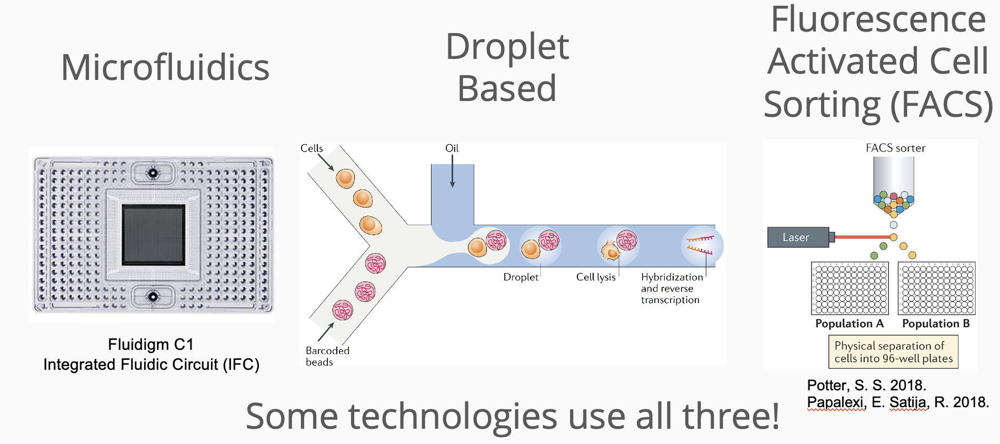

## Laser Capture Microdissection
\begin{columns}
	\begin{column}{0.5\textwidth}
	\Large
  \begin{itemize}
    \item Technique for isolating groups of cells in situ
    \item Low throughput, requires expensive equipment
    \item Laser causes damage to tissue and degrades RNA
    \item Not generally suitable for single cell sequencing
  \end{itemize}
	\end{column}
	
	\begin{column}{0.5\textwidth}
	\center
	\includegraphics[width=2.5in]{figs/lasermicrodissection.png}
	\end{column}
\end{columns}


## Fluorescence-Activated Cell Sorting (FACS)

\Large
\begin{itemize}
    \item Cells with known surface markers are tagged with fluorescent antibodies
    \item Tagged cells excited by lasers during flow cytometry
    \item Excited and non-excited cells separated and collected
    \item Cell type specific populations can be sequenced and studied
\end{itemize}

## Fluorescence-Activated Cell Sorting (FACS)

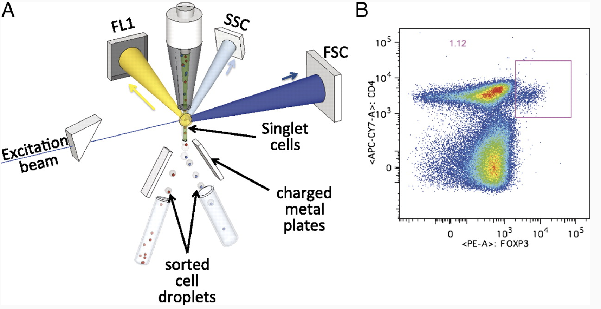

\tiny
Jaye, David L., Robert A. Bray, Howard M. Gebel, Wayne A. C. Harris, and Edmund K. Waller. 2012. “Translational Applications of Flow Cytometry in Clinical Practice.” Journal of Immunology 188 (10): 4715–19.

## Drop-seq

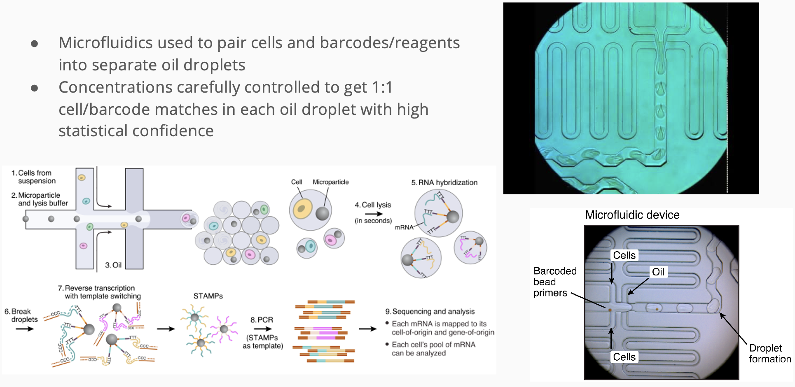

## inDrops

Essentially the same strategy Drop-Seq, but uses hydrogel beads 
\center
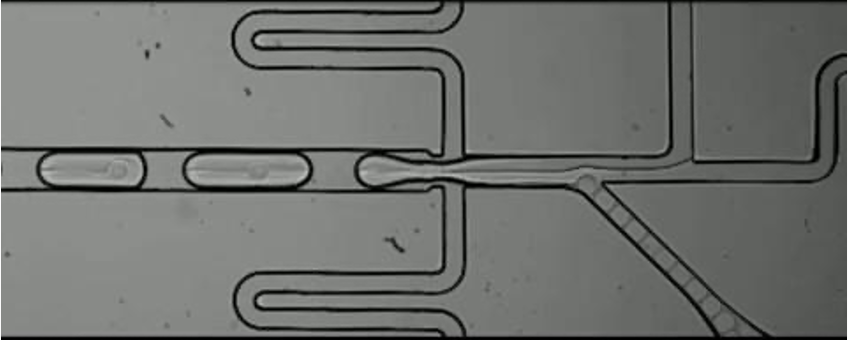{width=70%}

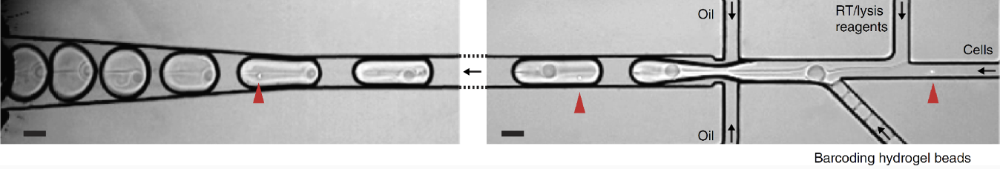{width=70%}

## A decade of single cell RNA-seq
\center
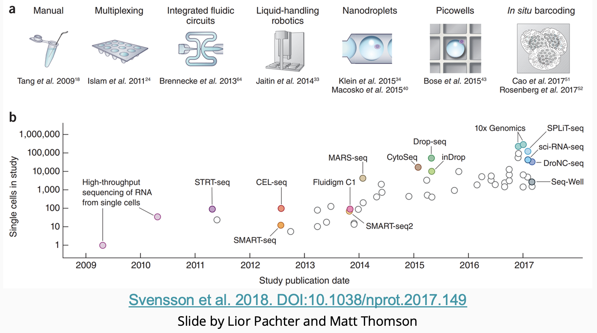{width=80%}

## A decade of single cell RNA-seq
\center
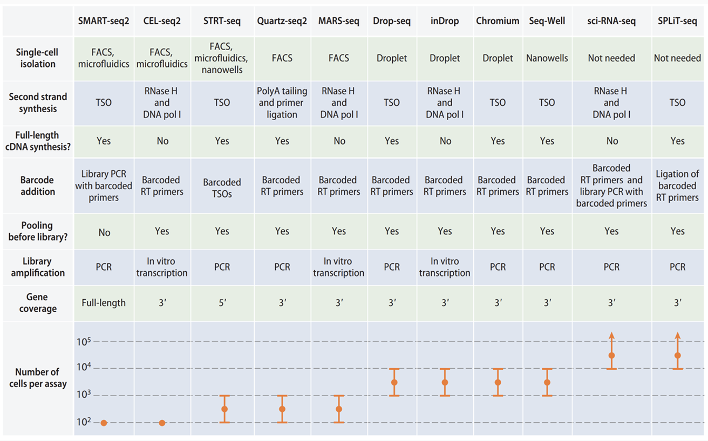{height=70%}

\footnotesize
Chen et al. 2018. DOI:10.1146/annurev-biodatasci-080917-013452


## Nucleic Acid Extraction + Processing

\Large
femto to picograms of input material

Each cell is:

  - Assigned a unique DNA barcode
  - Optionally treated with UMIs
  - Amplified by one of:
    - Reverse transcriptase (RNA)
    - Multiple displacement amplification (DNA)
    - In vitro transcription (RNA)


## Unique Molecular Identifiers (UMIs)

\Large
- Low input material may cause amplification bias
- UMIs are sequences that correspond to one fragment 
- Sequenced reads with the same UMI are from the same fragment
- Unique sequences collapsed/deduplicated for counting

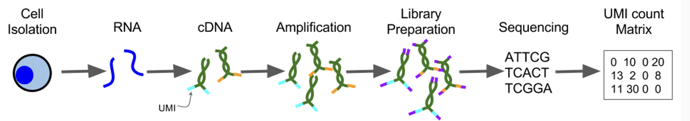


## Unique Molecular Identifiers (UMIs) 
Strategies for counting individual molecules
\center
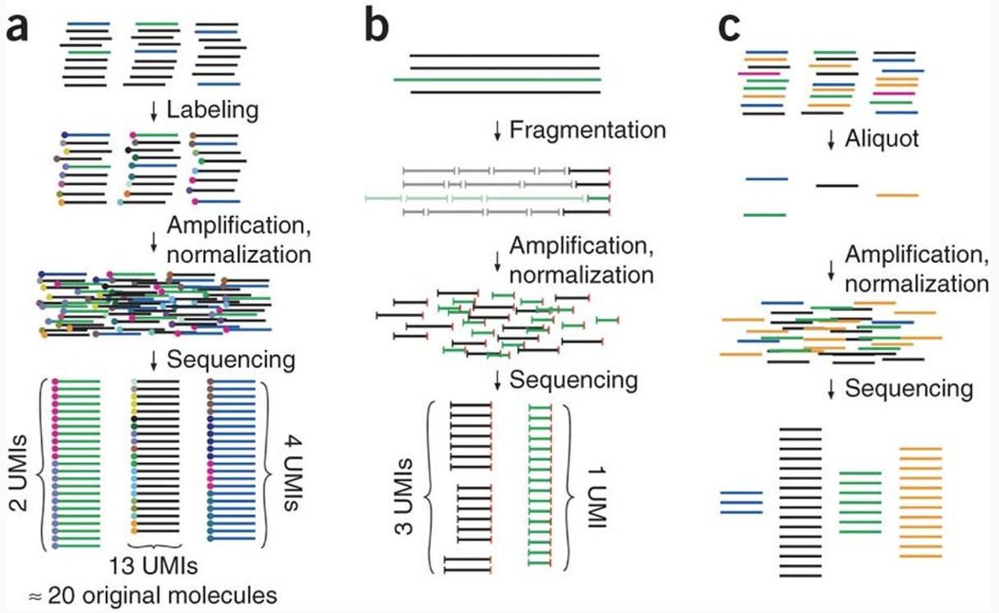{height=60%}

\tiny
Kivioja et al. 2011. “Counting Absolute Numbers of Molecules Using Unique Molecular Identifiers.” Nature Methods 9 (1): 72–74.

## Sequencing Library Prep and Sequencing

\Large
- Previous protocols typically include sequencing primers
- Sequencing depth = (# of cells) x (required depth):
  - RNA - 50k paired end reads / cell for cell type classification
  - RNA - .25M-1M paired reads / cell for transcriptome coverage
  - DNA - 30-100x per cell
- e.g. 1000 cell scRNA-Seq = 250M-1B reads per sample!
- Sequences in one PE fastq file are entirely barcodes
- Read length > 50bp for annotated genome
- Single cell sequencing is still *very expensive*

\tiny
Rizzetto, et al. 2017. “Impact of Sequencing Depth and Read Length on Single Cell RNA Sequencing Data of T Cells.” Scientific Reports 7 (1): 12781.

## scDNA-Seq Workflow
\center
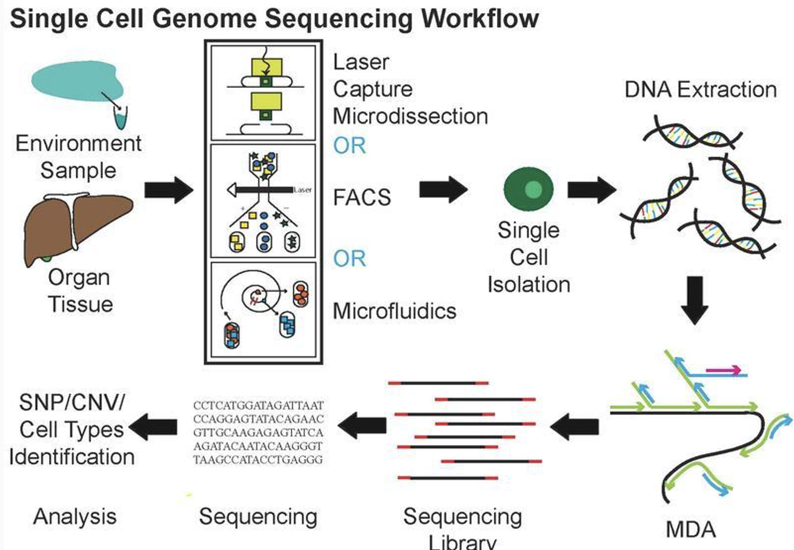{height=70%}

## scRNA-seq workflow
\center
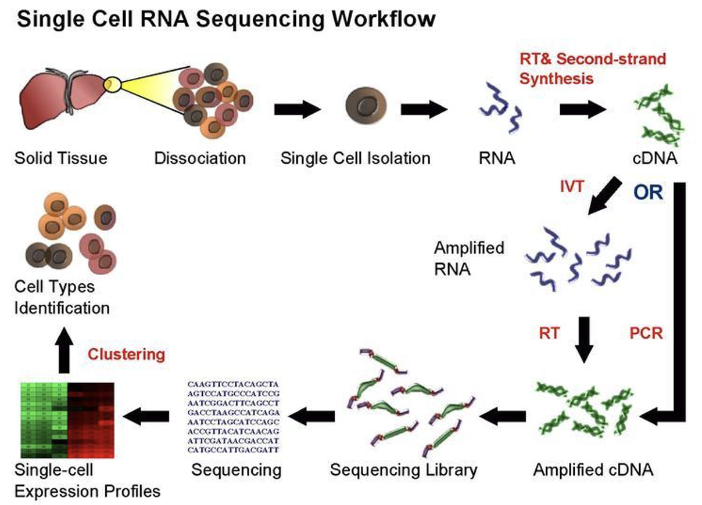{height=70%}

## Analysis Overview

\begin{columns}
	\begin{column}{0.5\textwidth}
	\Large
  \begin{enumerate}
    \item Sequence QC
    \begin{enumerate}
      \item Demultiplex
      \item UMI Collapsing
    \end{enumerate}
    \item Alignment
    \item Quantification
    \item Normalization
    \item DE, Clustering, etc
	\end{enumerate}
	\end{column}
	
	\begin{column}{0.5\textwidth}
	\center
	\includegraphics[width=1.75in]{figs/analysis.png}
	\end{column}
\end{columns}


## scruff R/Bioconductor package
\center
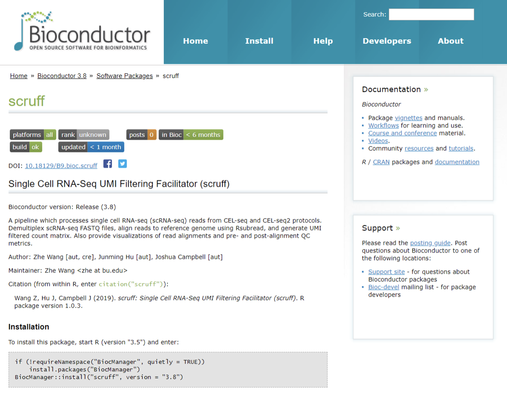

## Sequence QC
\Large
One sample is 100s or 1000s of cells

  * i.e. ~1,000 fastq files per sample
  * May or may not be already demultiplexed by core

UMI-Tools - open source UMI software

Normal fastq processing and QC:

  * Adapter and quality trimming
  * fastqc, multiqc


## Alignment and Quantification
\Large
STAR+htseq-count, kallisto, salmon, CellRanger

Each sample has a different # of cells

Each cell has the same number of measurements (e.g. genes)
= (# of samples) x (# of cells) x (# of genes)

Sparse: most will be zero!

## Amarel Submission Script for CellRanger
\scriptsize
```{bash, eval=F}
#!/bin/bash
#SBATCH --partition=main
#SBATCH --job-name=cellranger_bam
#SBATCH --array=0-3,5,6
#SBATCH --cpus-per-task=30
#SBATCH --mem=100G
#SBATCH --time=24:00:00

# path to fastq files
FASTQPATH=/scratch/$USER/tmp/awsbucket/fastqs/

# get sample to process
INDEX=$(($SLURM_ARRAY_TASK_ID))
INPUT=($(ls -d $FASTQPATH*R1_001.fastq.gz))
FASTQ=($(echo ${INPUT[$INDEX]##*/} | cut -d_ -f1-1))

# Path to cellranger
crpath=/projects/f_wj183_1/apps/cellranger-8.0.1/
```

## Amarel Submission Script for CellRanger
\footnotesize
```{bash, eval=F}
# path to reference library
refpath=/projects/f_wj183_1/reflib/2024_cellranger/refdata-gex-GRCh38-2024-A/
cd $FASTQPATH

# load python 
module load python/3.8.2

$crpath/./cellranger count --id=$FASTQ \
   --create-bam=true \	# true or false, necessary
   --sample=$FASTQ \ # prefix of files to align
   --fastqs=$FASTQPATH \ 
   --localcores=30 \ 
   --localmem=100 \ 	
   --chemistry=SC3Pv2 \	# optional 	
   --transcriptome=$refpath 
```


## The Counts Matrix

\Large
- Counts matrix contains either:
  - Read counts or
  - UMI counts if used
- Each cell has:
  - Total number of counts (col. sum, “library size”)
  - Number of non-zero genes
- Each gene has:
  - number of non-zero cells
  - Non-zero mean/variance
- Matrix is sparse: many zeros
- Zeros may be:
  - Cell lacks gene
  - A “drop-out”: gene present but was missed by qPCR

## The Counts Matrix
\center
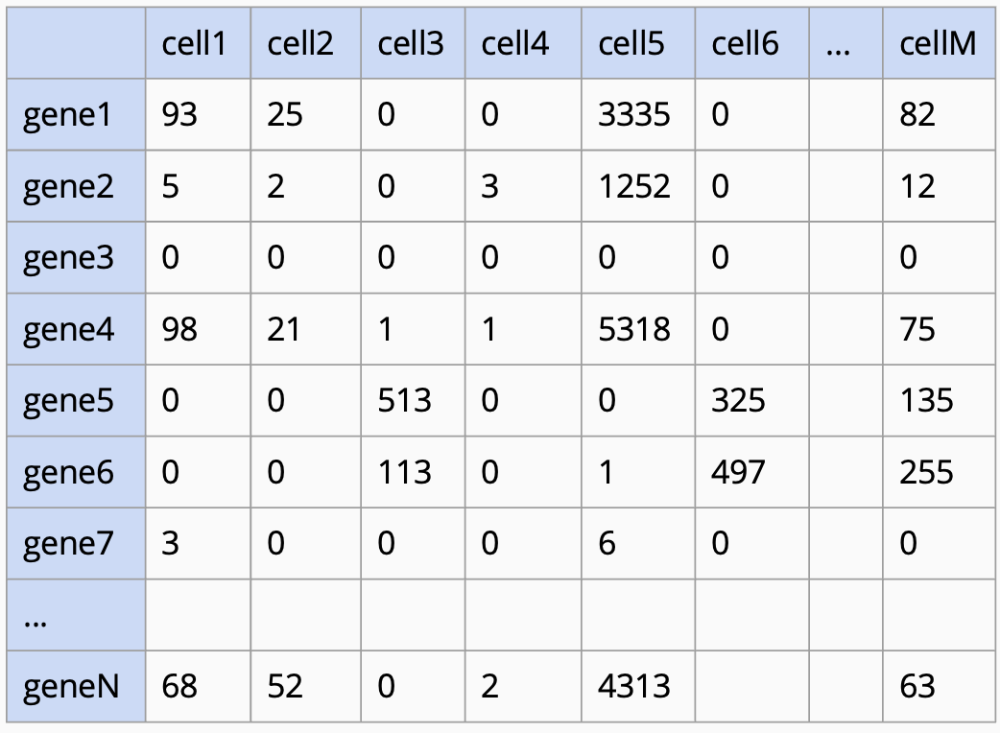{height=70%}

## Cell Quality Control

\Large
- Consider metrics jointly and threshold by outliers in distribution
- Most common cell QC metrics are:
  - Count depth
  - Number of genes
  - Fraction of mitochondrial genes


## Cell Quality Control
\center
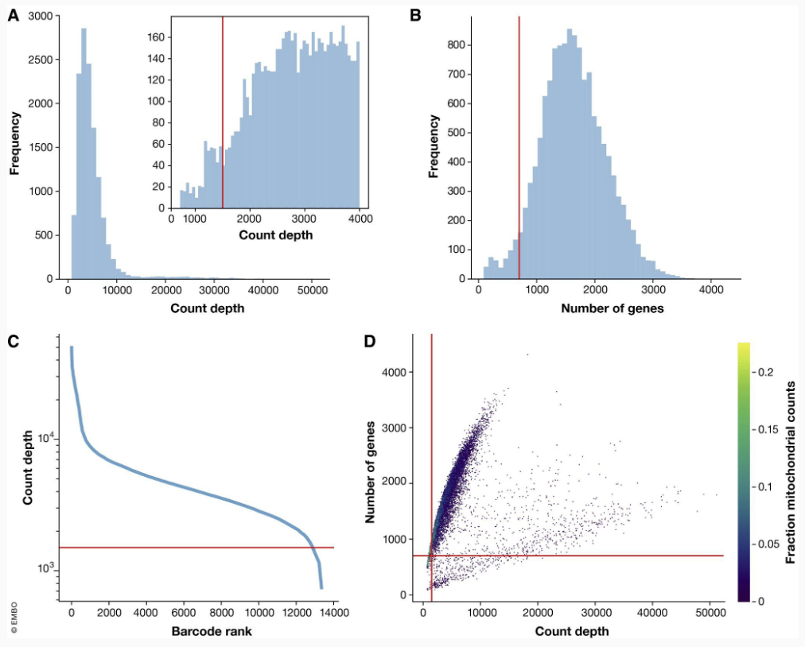{height=70%}


## Cell QC metrics should be considered together
\Large
**Example 1:**

Cell with high % of MT genes may represent:

- Cell subtypes highly engaged in respiratory processes (muscle, fat, etc.)
- Broken cells where the cytoplasmic mRNA has escaped, leaving only the MT RNA
- Cell with low count depth, few genes, and high % of MT genes may be a better marker of true “broken” cell events

## Cell QC metrics should be considered together
\Large
**Example 2:**

Cell with abnormally high count depth and large amount of genes may represent: 

- Doublets (droplets or events containing multiple cells)
- Larger cells (cell size can correlate with counts)
- Newly developed tools specifically handle doublets and attempt to resolve these cases (Scrublet, Doublet Finder, etc)

## Cell QC metrics should be considered together
\Large
**Example 3:**

Cell with low counts and low amount of genes may represent:

- “Empty” droplets or events
- Quiescent cell populations


## Additional QC Checks

\Large
- Remove genes that are only expressed in a few cells
  - This naturally sets a limit on the size of cell clusters you can recover
  - i.e. Removing genes expressed in fewer than 20 cells will make it difficult to detect clusters smaller than this
- Account for ambient gene expression (contaminating mRNA from lysed cells prior to library construction)

## Filtering Cells and Genes

\Large
Many measurements

- e.g. 30k genes x 1ks of cells

Some cells are uninformative, e.g.:

- Very few reads, few genes detected
- Two cells sequenced together (i.e. doublets)

Some genes are uninformative:

- Low # reads, low variance across all cells
- Too few cells express gene (e.g. < 10 of 10,000 cells nonzero)

Must filter genes _and_ cells to reduce noise

## Filtering the Counts Matrix

\Large
Cells might also be filtered:

- Very few or zero counts (cell4)
  - Empty well?
  - Ambient expression?
  - Quiescent cell?
- Very many counts (cell5)
  - Possible “doublet” of same cell type
- Inconsistent expression pattern (cellM)
  - Possible “doublet” of different cell types

Doublet: two cells with same cell barcode

## Filtering the Counts Matrix
\center
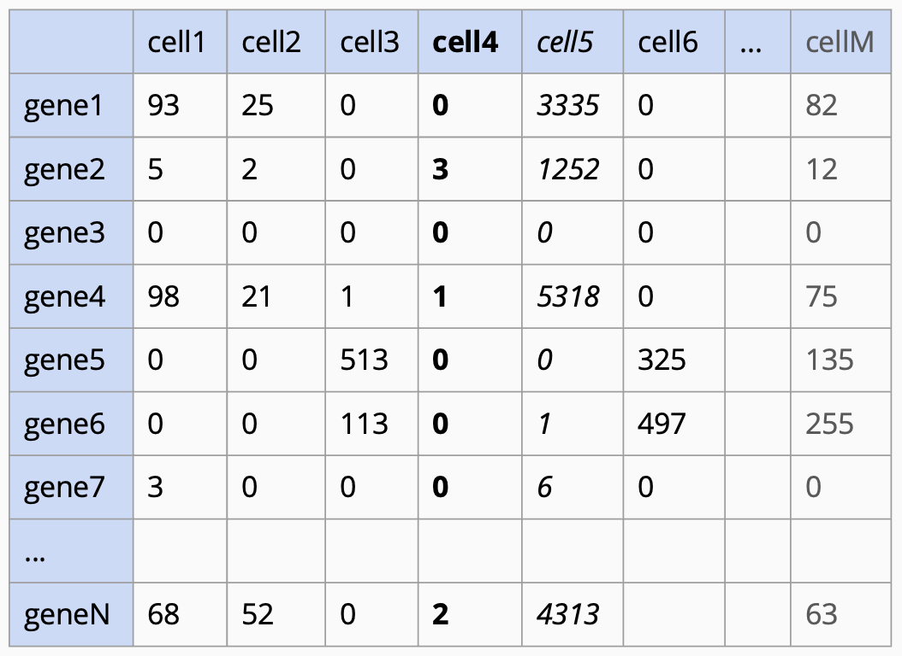{height=70%}


## Session info
\tiny
```{r session info}
sessionInfo()
```
